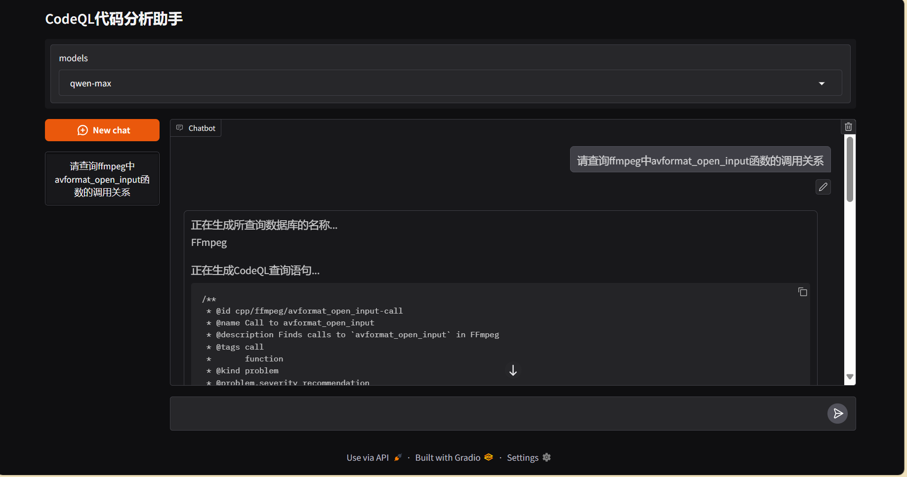
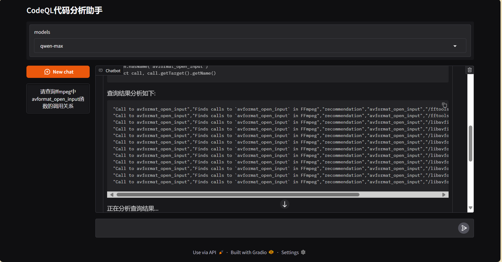
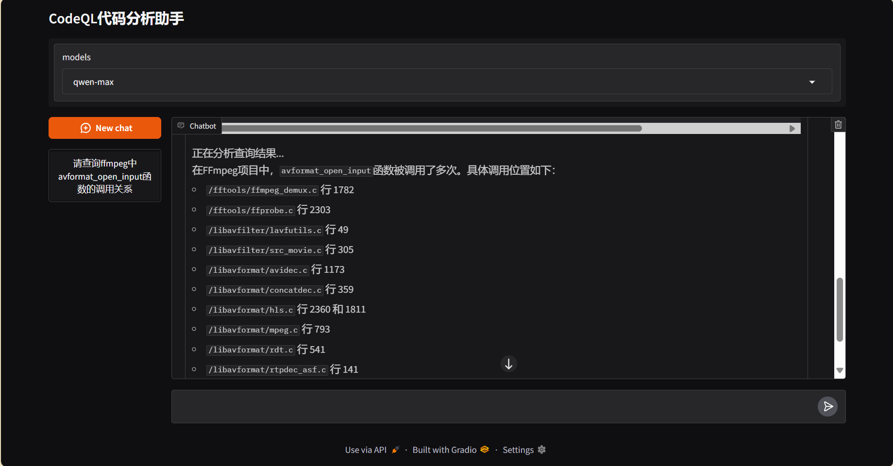

# CodeQL 代码调用链分析助手
## 介绍
CodeQL 是一种强大的代码分析工具，广泛应用于安全审计、漏洞检测和代码质量提升等领域。本项目融合CodeQL和LLM技术，同时使用python和gradio前端框架，实现了一个代码调用链分析助手，帮助用户更高效地进行代码分析和查询。

## 功能
- 支持多种编程语言的代码分析，包括但不限于C/C++、JavaScript、Python等。
- 通过自然语言描述查询需求，自动生成CodeQL查询语句。
- 如果生成的查询语句有误，系统会自动重复尝试生成，直到生成正确的查询语句。
- 提供友好的用户界面，方便用户输入查询需求并查看查询结果。
- 支持多个数据库的管理和切换，方便用户对不同项目进行分析。

## 技术栈
- 后端：Python，使用os、json等原生库进行文件和目录操作。
- 前端：Gradio，提供交互式用户界面。
- 代码分析：CodeQL，进行代码查询和分析。
- 大语言模型：用于将自然语言查询需求转换为CodeQL查询语句。
- 容器化：Docker，确保环境一致性和依赖管理。

## 使用方法
1. 克隆项目到本地并使用docker-compose进行构建：
    ```bash
    git clone
    docker compose build
    ```

2. 进行项目配置：
    在项目根目录下创建一个名为`dbconfig.json`的文件，用于存储数据库的配置信息。该文件的结构如下所示：
    ```json
    {
        "db_name": {
            "language": "cpp",
            "srcPath": "src",
            "command": "make"
        }
    }
    ```
    其中，`db_name`是数据库的名称，`language`是编程语言，`srcPath`是源代码路径，`command`是创建数据库时使用的命令。

    同时根据需要配置LLM所需的API Key，例如使用阿里的API Key：
    ```bash
    export DASHSCOPE_API_KEY="your_openai_api_key"
    ```

3. 启动服务：
    ```bash
    docker compose up -d
    ```

4. 访问前端界面：
    打开浏览器，访问`http://localhost:7860`，即可看到代码调用链分析助手的界面。

5. 输入查询需求：
    在输入框中描述你想要查询的项目以及对应的函数调用链信息，例如“查找所有jsmn项目中的调用`jsmn_alloc_token`函数的地方”，然后点击发送按钮。会自动生成CodeQL查询语句并执行，最终返回易于理解的查询结果。


> 数据库配置后首次启动时因为要创建数据库，时间会比较长，请耐心等待。

## 查询样例





## 具体的工作流

1. LLM根据用户的自然语言查询需求，选择合适的数据库，并生成CodeQL查询语句。
2. LLM根据给出的样例查询语句和查询需求，生成符合要求的CodeQL查询语句。
3. 系统执行生成的CodeQL查询语句，并将结果返回给用户。
4. 如果查询结果为空或查询语句有误，系统会自动重新生成查询语句，直到生成正确的查询语句为止。（最多尝试三次）
5. LLM会解读查询结果，并将其转换为易于理解的自然语言描述，返回给用户。

